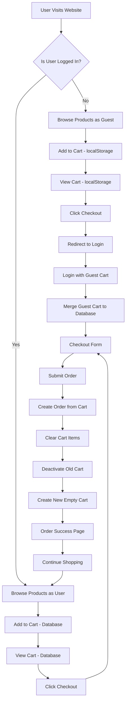
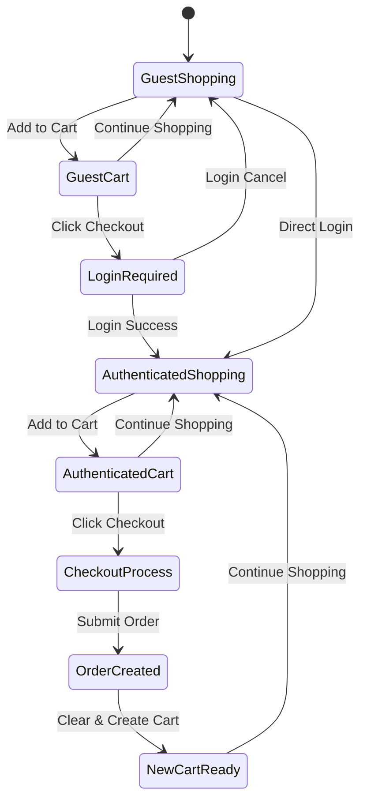
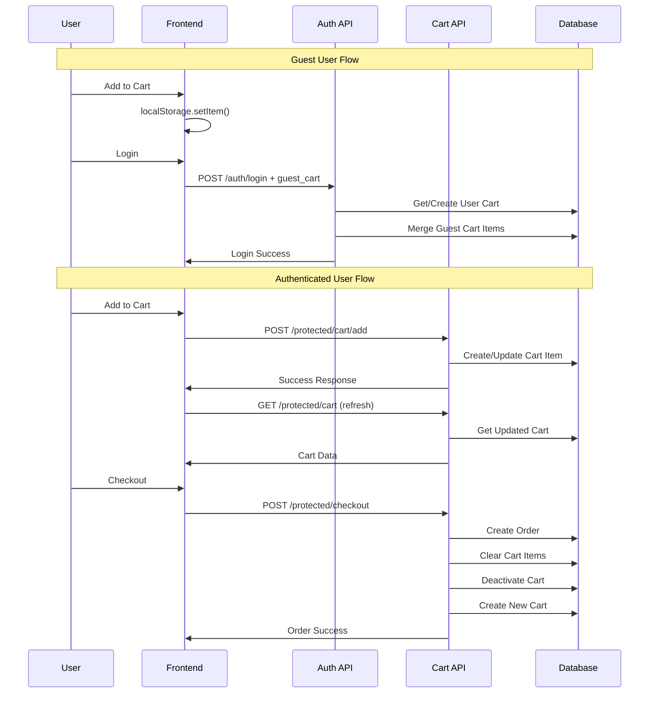
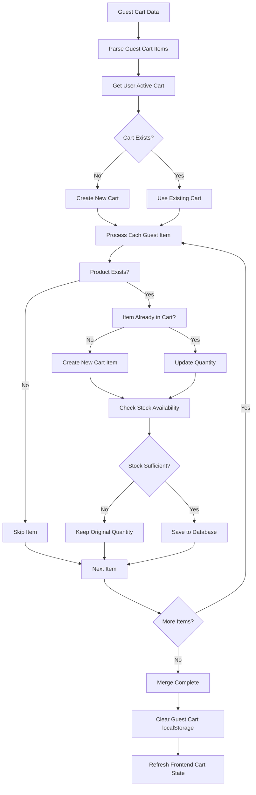
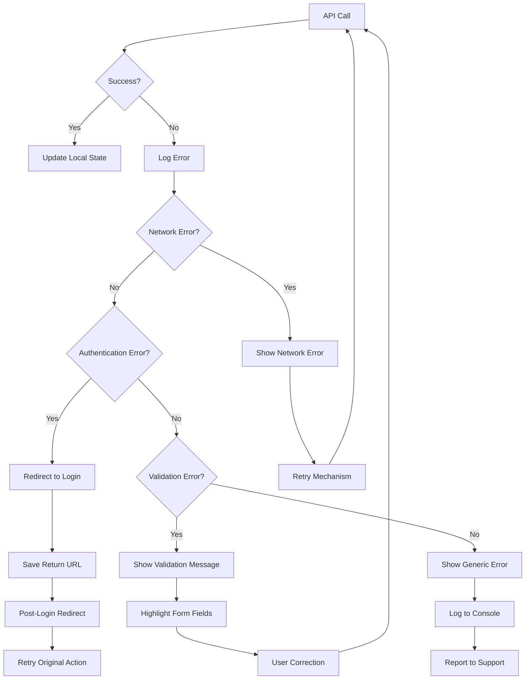
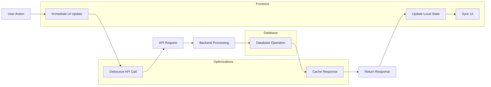
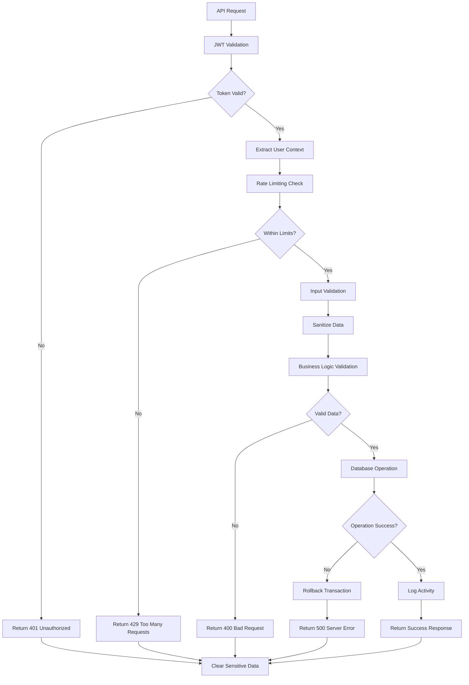
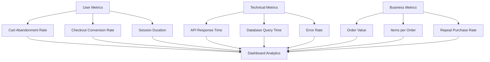

# E-Commerce System Flow Diagrams

## Complete User Journey Flow

## Shopping Cart State Management

## Database Operations Flow

## Cart Merge Process

## Error Handling Flow

## Performance Optimization Flow

## Security Validation Flow

## Testing Scenarios Matrix

| Scenario | Pre-conditions | Actions | Expected Results | Test Status |
|----------|----------------|---------|------------------|-------------|
| Guest Add to Cart | Not logged in | Add item to cart | Item saved in localStorage | ✅ |
| Guest View Cart | Items in localStorage | Navigate to /cart | Items displayed with product data | ✅ |
| Guest Checkout | Items in cart | Click checkout | Redirect to login | ✅ |
| Cart Merge | Guest cart + login | Login with guest cart | Items merged to database | ✅ |
| Authenticated Add | Logged in | Add item to cart | Item saved in database | ✅ |
| Cart Persistence | Logged in items | Refresh page | Items still in cart | ✅ |
| Checkout Flow | Items in cart | Complete checkout | Order created, cart cleared | ✅ |
| Error Handling | Network failure | Add to cart | Graceful error handling | ✅ |
| Stock Validation | Low stock item | Add to cart | Stock validation error | ✅ |
| Concurrent Access | Multiple tabs | Add items | Consistent cart state | ✅ |

## Monitoring Metrics

### Key Performance Indicators (KPIs)

---

## Implementation Checklist

### ✅ Completed Features
- [x] Guest cart localStorage storage
- [x] Authenticated cart database storage
- [x] Cart merge on login
- [x] Complete checkout flow
- [x] Order management system
- [x] Error handling and validation
- [x] API documentation with Swagger
- [x] Comprehensive logging

### 🔄 In Progress
- [ ] Performance optimization
- [ ] Advanced analytics
- [ ] Cross-device synchronization

### 📋 Planned Features
- [ ] Cart sharing functionality
- [ ] Wishlist integration
- [ ] Advanced filtering and search
- [ ] Mobile app integration
- [ ] Multi-language support

---

This documentation provides a complete overview of the e-commerce shopping cart system, including all flows, API endpoints, database operations, and implementation details.
